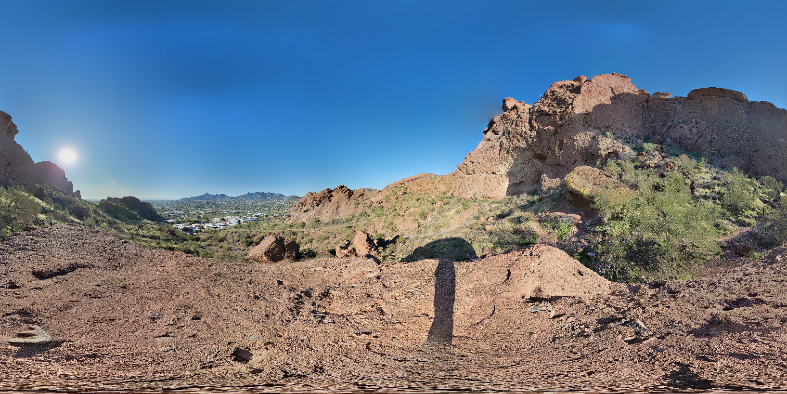
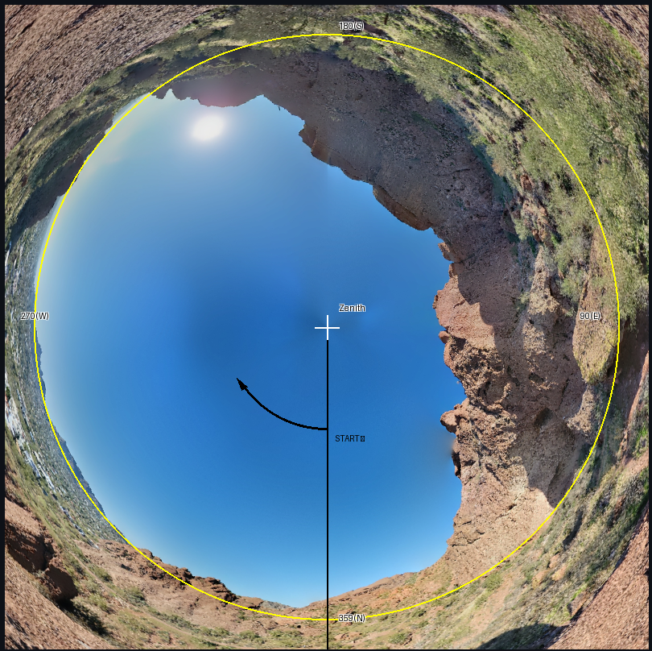
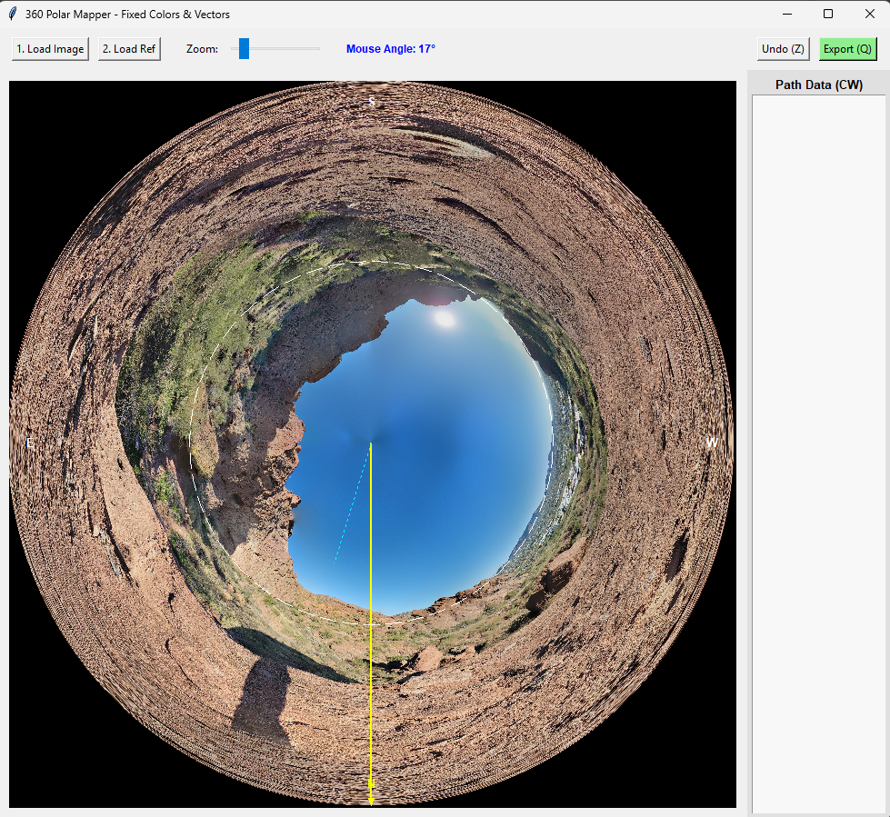
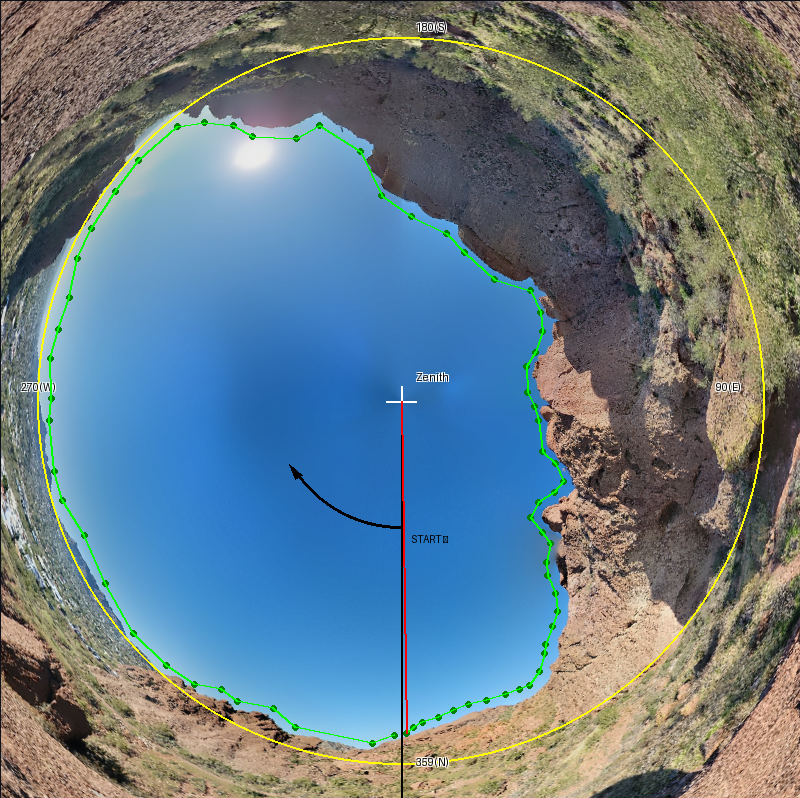
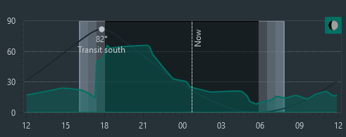
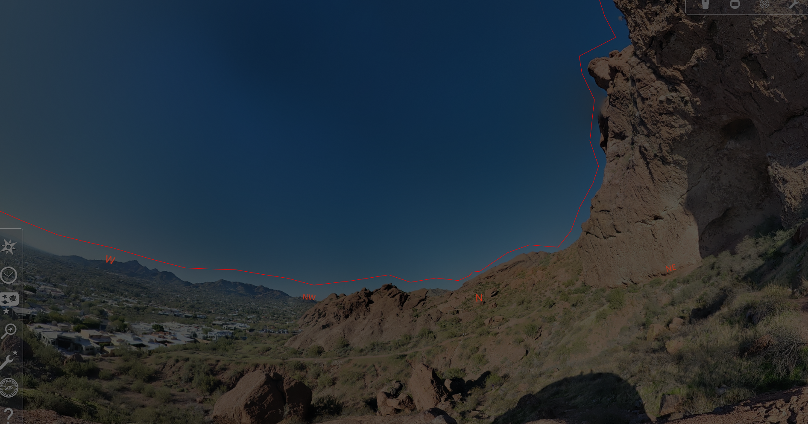

# 🌌 Astro-Horizon Precision Tool (Web)
### For N.I.N.A. Custom Horizons & Stellarium Landscape Polygons

> [!WARNING]
> **Beta Software:** This tool is in active development. Please verify your exported data before using it in critical astronomy sessions.

A specialized web utility for astrophotographers to create accurate horizon profiles. This tool warps 360° panoramas into a **Polar Projection**, allowing you to trace trees, buildings, and terrain to generate horizon files for **N.I.N.A.** and **Stellarium**.

## 🌐 Live Web App
**[https://stellariumilg-6jwr5zkfwcndsz8itzujsy.streamlit.app/]**

---

### Source Image Example (360° Equirectangular)

*Source: Example image from **360 Photo Cam** for iOS.*


> [!IMPORTANT]
> **Image Preparation:**
> 1. **Capture:** Use apps like **360 Photo Cam** (iOS) or **GCam** (Android).
> 2. **Alignment:** Ensure your panorama is centered on **True North**. The vertical center line of your image must be 0° Azimuth.

## 📸 Visual Workflow

| 1. Interface & Upload | 2. Tracing the Horizon | 3. Exported Path |
| :---: | :---: | :---: |
|  |  |  |

## 🚀 Key Features

* **Polar Transformation:** Center = Zenith (+90°), Yellow Circle = True Horizon (0°).
* **Angle Limiter:** A red dynamic vector showing your current azimuth.
* **Directional Lock:** Enforces a **Clockwise-only** trace (descending azimuth from 359° to 0°).
* **Real-time Data:** Automatically sorted log (0° to 359°) for direct software compatibility.

## 📖 How to Use

1.  **Upload:** Drag and drop your North-centered panorama into the sidebar.
2.  **Start:** Locate the **Black North Line** at the bottom (359°).
3.  **Trace:** Click along the horizon features following the **Clockwise Arrow**.
4.  **Stay Inside:** Only clicks inside the **Yellow Circle** (True Horizon) are valid.
5.  **Review:** Use the **Undo** button to fix mistakes or **Clear** to restart.
6.  **Export:** Click **Download .txt** to save your horizon profile.

## 🛠 Installation (For Local Running)

If you prefer to run the app on your own machine:

1.  **Clone the repo:**
    ```bash
    git clone https://github.com/Th0MmyS/stellarium_ilg.git
    cd stellarium_ilg
    ```
2.  **Install requirements:**
    ```bash
    pip install streamlit opencv-python-headless numpy Pillow streamlit-image-coordinates pandas
    ```
3.  **Run the app:**
    ```bash
    streamlit run app.py
    ```

## 💾 Coordinate System Logic


| Marker | Description |
| :--- | :--- |
| 🟡 **Yellow Circle** | **True Horizon:** 0° Elevation boundary. |
| 🔴 **Red Line** | **Angle Limiter:** Your current tracing position. |
| 🟢 **Green Path** | **Horizon Profile:** The shape of your obstructions. |
| ⚫ **Black Line** | **North Start:** Your starting point (359°). |
| ⚪ **White Cross** | **Zenith:** The point directly overhead (90° Elevation). |

## 🔭 Final Results Example

The exported `.txt` file is formatted for easy import into astronomy suites:

| N.I.N.A. Horizon | Stellarium Horizon |
| :---: | :---: |
|  |  |