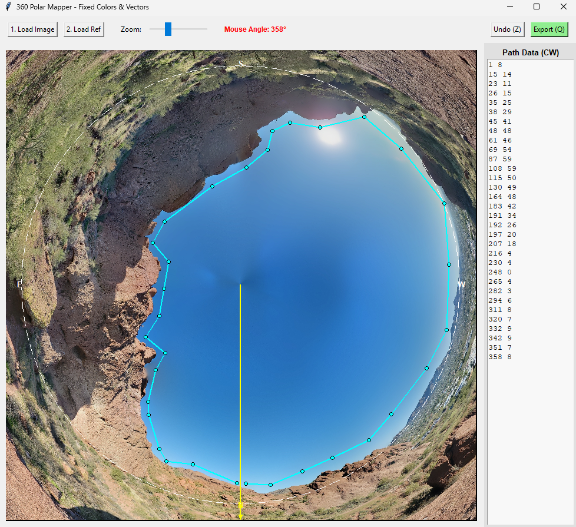

# 360° Polar Horizon Mapper (Beta)

> [!WARNING]
> **Beta Software:** This tool is currently in active development. Features and coordinate math may be subject to refinement. Please verify your exported data before using it in critical astronomy sessions.

A specialized desktop utility for tracing horizons and paths from 360° equirectangular panoramas. By warping the panorama into a circular **Polar Projection**, this tool eliminates the "seam" issues found in rectangular editors and ensures mathematically consistent coordinate exports for software like Stellarium and N.I.N.A.

### Source Image Example (360° Equirectangular)


> [!IMPORTANT]
> **Image Preparation:** Before loading, ensure your equirectangular panorama is centered on **True North**. The vertical center line of your image ($x = width/2$) must correspond to 0° Azimuth. If your image is not centered, the exported coordinates will be offset.

## 🚀 Key Features

* **Polar Transformation:** Projects equirectangular images into a 2D circle where the center is the Zenith (Sky) and the edges are the Nadir (Ground).
* **Horizon Baseline:** The 0° elevation (horizon) is mapped precisely to the **50% radius** mark, allowing for both positive and negative elevation tracking.
* **True North Orientation:** The coordinate system is oriented with **True North (0°)** pointing straight **down** from the center.
* **Angular Progression Lock:** Enforces a **Clockwise-only** clicking constraint. This prevents "spiraling" and ensures data is captured in a monotonic angular sequence.
* **Dynamic Vector Tracking:** Real-time visual lines from the center to the mouse cursor help visualize the exact angle and elevation before clicking.

## 📸 Visual Workflow

| 1. Interface | 2. Loaded Image |
| :---: | :---: |
|  |  |
| *Clean start state* | *Image warped to polar projection* |

| 3. Tracing Points | 4. Finished Path |
| :---: | :---: |
|  |  |
| *Clockwise progression tracking* | *Complete horizon data* |

## 🛠 Installation

### From Source
1.  **Clone the repo:**
    ```bash
    git clone [https://github.com/Th0MmyS/stellarium_ilg.git](https://github.com/Th0MmyS/stellarium_ilg.git)
    cd stellarium_ilg
    ```
2.  **Install dependencies:**
    ```bash
    pip install opencv-python numpy Pillow
    ```
3.  **Run the app:**
    ```bash
    python main.py
    ```

### From Standalone Executable
Go to the **releases** section on the right side of this GitHub page to download the standalone `.exe` (Windows). 

## 📖 How to Use

1.  **Load Image:** Select your 360° equirectangular panorama (must be North-centered).
2.  **Zoom:** Use the slider for fine details. 
3.  **Trace:** Click along your horizon features. The tool enforces **Clockwise** movement.
4.  **Undo:** Press `Z` to remove the last point.
5.  **Export:** Press `Q` to save `path_results.txt`.

## 📊 Coordinate System


| Parameter | Logic |
| :--- | :--- |
| **Angle (X)** | 0° to 359° (Clockwise, 0 = Bottom/North) |
| **Elevation (Y)** | -90° (Outer Edge) → 0° (Mid-Radius) → +90° (Center) |

## 🔭 Final Results Example

The exported data can be used to create custom horizons for astronomy software:

| N.I.N.A. Horizon | Stellarium Horizon |
| :---: | :---: |
|  |  |

## 🛠 Developer: Building the Executable
**Windows:**
```powershell
python -m PyInstaller --noconsole --onefile main.py
